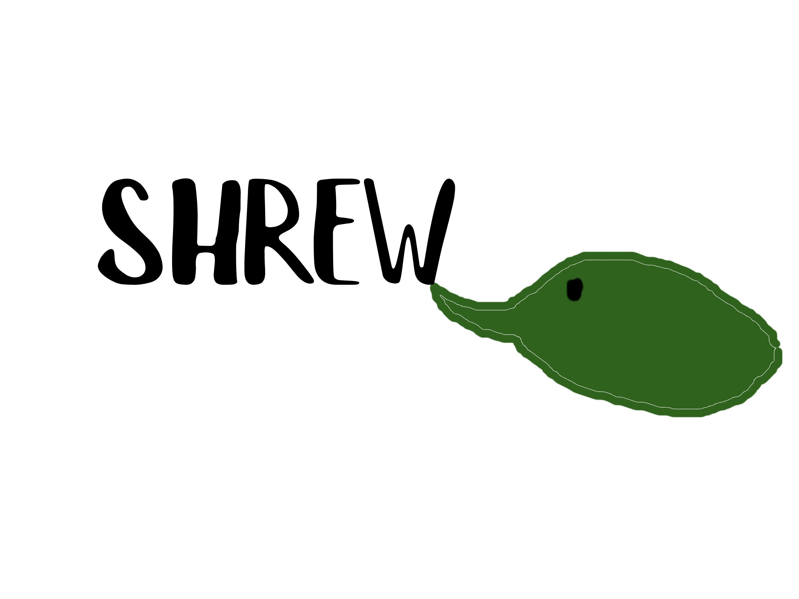

# Shrew Browser

A custom Chromium-based browser built with Electron by mrrat and Gravity. Quick, clever, and always one step ahead - just like a shrew!



## ✨ Features

### Core Browser
- **Custom Homepage** - Shrew-themed with quick links and search
- **Smart Search** - DuckDuckGo web scraping with malware blocking
- **Wikipedia Integration** - Automatic summaries with images
- **Navigation Controls** - Back, forward, reload buttons
- **Custom URL Bar** - Search or navigate seamlessly

### Search Engine
- 🔍 Real web results from DuckDuckGo
- 📚 Wikipedia summaries with thumbnails
- ⚠️ **Malware Protection** - Blocks suspicious domains automatically
- 🌐 Quick links to Google, YouTube, Reddit, GitHub

### Easter Eggs
- 🎮 **Snake Game** - Search "snake" to play a retro game with cheese!
  - Controls: Arrow keys or WASD
  - Tracks high score
  - Embedded in search results

### Special Features
- **rcked Easter Egg** - Search "rcked" for a special result
- Floating animations on homepage
- 🎨 Pink and dark theme throughout
- 💾 Persistent cookies and sessions

## 📥 Installation

### For Users
1. Download `Shrew Setup.exe` from [Releases](https://github.com/mrratcool78/shrew/releases)
2. Run the installer
3. Launch Shrew from your desktop or start menu

### For Developers
```bash
# Clone the repo
git clone <repository-url>
cd shrew

# Install dependencies
npm install

# Run in development
npm start

# Build for Windows
npm run build-win
```

## 🎮 How to Use

### Basic Navigation
- Type a URL in the address bar to visit websites
- Type anything else to search the web
- Click the back/forward arrows to navigate
- Click the refresh button to reload

### Homepage Quick Links
- YouTube 📺
- Discord 💬
- GitHub 💻
- Reddit 🗨️
- Twitter 🐦
- Twitch 🎮

### Easter Eggs
Try searching for these:
- **"snake"** - Play the Shrew Snake game!
- **"rcked"** - Special shoutout to rcked.pages.dev

## 🛡️ Security Features

### Malware Blocking
Automatically blocks:
- Suspicious TLDs (.tk, .ml, .ga, .cf, .gq, .cc, .ws)
- Download/crack/torrent sites from .ru/.cn
- Sites with virus/malware keywords
- Executable file downloads

### Privacy
- Cookies saved locally
- No tracking or analytics
- CORS disabled for better scraping (use responsibly)

## 🔧 Technical Details

### Built With
- **Electron** - Desktop app framework
- **Chromium** - Browser engine
- **Node.js** - Backend runtime
- **DuckDuckGo** - Search provider
- **Wikipedia API** - Knowledge integration

### Project Structure
```
shrew/
├── main.js           # Electron main process
├── index.html        # Browser UI
├── homepage.html     # Custom homepage
├── search.html       # Search results page
├── Untitled.png      # Browser logo
├── package.json      # Dependencies
```

## 🎨 Customization

Want to modify Shrew? Here's where to look:

- **Colors**: Edit CSS in `homepage.html` and `search.html`
- **Quick Links**: Modify the link cards in `homepage.html`
- **Search Provider**: Update scraping logic in `search.html`
- **Easter Eggs**: Add more in the search navigation logic

## 🐛 Known Issues

- YouTube may show black screen if not logged in
- Some sites require login for full functionality
- Auto-update requires code signing (not implemented yet)

## 📝 License

Proprietary License - All Rights Reserved

See [LICENSE](LICENSE) for details.

## 👥 Credits

**Created by:**
- **mrratcool78** - Lead developer
- **Gravity** - Co-creator and creative direction

**Special Thanks:**
- rcked.pages.dev for inspiration

## 🔮 Future Features

- [ ] Browser tabs
- [ ] Bookmark manager
- [ ] Download manager
- [ ] Extensions support
- [ ] Dark mode toggle
- [ ] More easter eggs
- [ ] Custom themes

## 💬 Feedback

Found a bug? Have a feature request? 
- Use the thumbs down button in the browser
- Open an issue on GitHub
- Contact mrratcool78

---

**"small in size, mighty in spirit - the shrew way"** - ancient shrew wisdom

️ Welcome to Shrew
